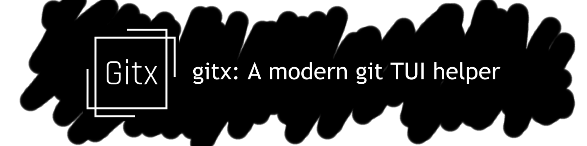

# 🌟 gitxtui/gitx

#### A terminal-based Git interface designed to make version control more accessible

<table>
  <tr>
    <td width="200"><h3>📝 About</h3></td>
    <td style="text-align: justify;"><a href="https://github.com/gitxtui/gitx">Gitx</a> is a Git TUI (Terminal User Interface) that helps newcomers learn Git through an intuitive, friction-free experience. Similar to tools like lazygit, but with a focus on education and ease of use.</td>
  </tr>
  <tr>
    <td width="200"><h3>🎯 Our Mission</h3></td>
    <td style="text-align: justify;">We believe Git should be accessible to everyone. gitx bridges the gap between powerful version control and user-friendly interfaces, helping new developers build confidence with Git through practical use.</td>
  </tr>
  <tr>
    <td width="200"><h3>👥 Team</h3></td>
    <td>
      
      
      
      
    </td>
  </tr>
</table>
