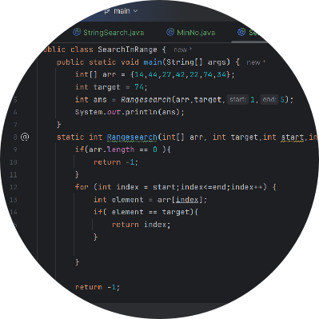

# 🌟 gitxtui/gitx

A terminal-based Git interface designed to make version control more accessible.

## 📝 About

[`Gitx`](https://github.com/gitxtui/gitx) is a Git TUI (Terminal User Interface) that helps newcomers learn Git through an intuitive, friction-free experience. Similar to tools like lazygit, but with a focus on education and ease of use.

## ✨ Key Features

- **🧠 Beginner-friendly UI**: Intuitive interface that simplifies Git operations
- **💡 Learning aids**: Helpful hints and explanations for Git commands
- **🚀 Reduced friction**: Execute complex Git workflows with ease
- **💻 Terminal-based**: Learn Git in its natural environment

## 🎯 Our Mission

We believe Git should be accessible to everyone. gitx bridges the gap between powerful version control and user-friendly interfaces, helping new developers build confidence with Git through practical use.

## 👥 Team

Built by a team of developers passionate about developer tools and education:

-  [Ayush](https://github.com/bakayu) - Lead Maintainer
-  [Anmol Puri](https://github.com/Anmol-Puri-Coder) - Co-Lead Maintainer
-  [Ashmit Singh](https://github.com/Ashmit9955) - Maintainer
-  [Anmol Kakkar](https://github.com/AnmolKakkar15) - Maintainer
